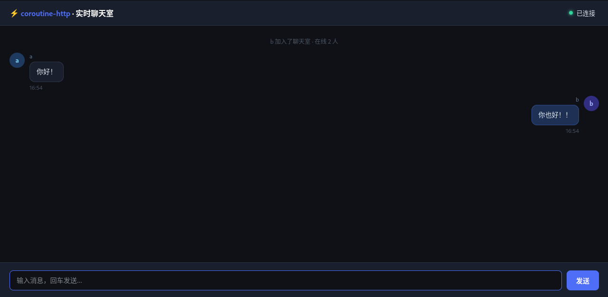

# coroutine-http

> 从零实现基于 `ucontext + epoll` 的用户态协程调度器，在此之上构建完整 HTTP/1.1 服务器。  
> 以同步代码风格处理异步 I/O，支持多线程、WebSocket、MariaDB 持久化，无任何第三方框架依赖。

---

## Demo 截图

> 启动服务器后浏览器访问 `http://localhost:8888`



---

## 性能数据

> 测试环境：VMware 虚拟机 4核，wrk -t4 -c100 -d10s

| 模式 | 路由 | QPS | 平均延迟 |
|------|------|-----|---------|
| 单线程（2核）| GET /api/ping | 79,928 | 1.39ms |
| 多线程（2核）| GET /api/ping | 83,405 | — |
| **多线程（4核）**| GET /api/ping | **175,323** | 21.57ms |

多线程调度器下性能随核心数近线性扩展，4核相比单线程提升 **119%**。

---

## 技术栈

- **语言**：C++17
- **平台**：Linux（依赖 `ucontext`、`epoll`）
- **数据库**：MariaDB（通过 `libmariadb` 接入）
- **加密**：OpenSSL（WebSocket 握手 SHA1）
- **构建**：GNU Make + g++

---

## 架构

```
┌──────────────────────────────────────────────────────┐
│          前端 (index.html / chat.html)                │
│    REST API (fetch)  ←→  WebSocket 实时聊天室         │
├──────────────────────────────────────────────────────┤
│                     HttpServer                        │
│         路由匹配 / 中间件 / Keep-Alive 循环            │
├───────────────────┬──────────────────────────────────┤
│   HttpParser      │  HttpRequest / HttpResponse       │
├───────────────────┴──────────────────────────────────┤
│          WebSocket (握手 / 帧解析 / ChatRoom)         │
├──────────────────────────────────────────────────────┤
│         Connection           TcpServer                │
│   协程友好 read/write     非阻塞 accept 循环           │
├──────────────────────────────────────────────────────┤
│                  MultiScheduler                       │
│        Scheduler × N（每核一个线程）                  │
│   ready_queue │ waiting_map │ timer_heap │ pipe唤醒   │
│            ucontext + epoll 事件驱动                  │
├──────────────────────────────────────────────────────┤
│                    Database                           │
│          MariaDB RAII 连接封装 / SQL 防注入            │
└──────────────────────────────────────────────────────┘
```

**调度流程：**
```
while (有就绪任务 || 有 I/O 等待 || 有定时器)
  1. 执行所有就绪协程（swapcontext）
  2. 触发到期定时器 → 放入就绪队列
  3. epoll_wait（超时 = 下一个定时器剩余毫秒）
  4. I/O 就绪 → 对应协程放入就绪队列
  5. pipe 可读 → 取出跨线程投递的新协程
```

---

## 功能

### 协程调度器（多线程）
- `ucontext` 上下文切换，每个协程独立 128KB 栈
- `epoll` 事件驱动，边缘触发（ET）模式
- 最小堆定时器，`sleep(ms)` 精确挂起协程
- `Channel<T>` 协程间同步通信（参考 Go channel 设计）
- `post()` 线程安全跨线程投递，用 `pipe` 唤醒目标线程 `epoll_wait`
- `MultiScheduler` 管理多个调度器线程，新连接 round-robin 分发

### TCP 层
- 非阻塞 `accept`，ET 模式下一次性抽干积压连接
- `Connection` 封装读写，自动处理 `EAGAIN` 和部分写
- `read_until(delim)` / `read_exact(n)` 流式读取接口

### HTTP 层
- HTTP/1.1 完整解析（请求行、headers、body）
- URL decode，query string 解析，路径参数路由（`:id`）和通配路由（`*`）
- Keep-Alive 连接复用
- 链式响应 API：`res.status(200).json(conn, body)`
- 静态文件服务，自动识别 MIME 类型

### WebSocket
- 基于 HTTP Upgrade 握手（RFC 6455），SHA1 + Base64 计算 Accept
- 完整帧解析：支持 TEXT / PING / CLOSE，自动解掩码
- 服务端帧封装，支持 126/127 扩展长度
- `ChatRoom` 实现广播聊天室，互斥锁保证多线程安全

### 数据库
- MariaDB RAII 连接封装，`query()` 返回 `vector<map<string,string>>`
- `escape()` 防 SQL 注入
- 支持用户增删查 REST API

### 前端 Demo
- `index.html`：用户 CRUD，ping 延迟检测
- `chat.html`：WebSocket 实时聊天室，支持多人同时在线

---

## 文件结构

```
.
├── core/
│   ├── coroutine.h/cpp     # Coroutine / Scheduler / MultiScheduler / Channel<T>
├── net/
│   ├── connection.h/cpp    # TCP 连接封装
│   └── tcp_server.h/cpp    # 监听 + accept + 分发
├── http/
│   ├── http_request.h/cpp
│   ├── http_response.h/cpp
│   ├── http_parser.h/cpp
│   └── http_server.h/cpp   # 路由器 + 服务器
├── ws/
│   ├── websocket.h/cpp     # WebSocket 握手 + 帧收发
│   └── chat_room.h         # 广播聊天室（线程安全）
├── db/
│   └── database.h/cpp      # MariaDB RAII 封装
├── static/
│   ├── index.html          # REST API Demo
│   └── chat.html           # WebSocket 聊天室
├── test/
│   └── bench.sh            # wrk 压测脚本
├── main.cpp
└── Makefile
```

---

## 编译与运行

**依赖安装：**
```bash
sudo apt install libmariadb-dev libssl-dev wrk
sudo systemctl enable --now mariadb
```

**数据库初始化（首次）：**
```bash
sudo mariadb
```
```sql
CREATE DATABASE coroutine_http;
USE coroutine_http;
CREATE TABLE users (
    id INT AUTO_INCREMENT PRIMARY KEY,
    name VARCHAR(50) NOT NULL,
    email VARCHAR(100) UNIQUE NOT NULL,
    role VARCHAR(20) DEFAULT 'user',
    created_at TIMESTAMP DEFAULT CURRENT_TIMESTAMP
);
INSERT INTO users (name, email, role) VALUES
    ('Alice', 'alice@example.com', 'admin'),
    ('Bob',   'bob@example.com',   'user'),
    ('Charlie','charlie@example.com','user');
exit
```

**编译运行：**
```bash
make
./http_server
# [Main] 启动 4 个调度器线程
# [DB] 数据库连接成功
# [TcpServer] 监听端口 8888
```

**访问：**
```
http://localhost:8888                    # REST API Demo
http://localhost:8888/static/chat.html  # WebSocket 聊天室
```

**压测：**
```bash
wrk -t4 -c100 -d10s http://localhost:8888/api/ping
```

---

## API 路由

| 方法 | 路径 | 说明 |
|------|------|------|
| GET | `/` | REST API Demo 页面 |
| GET | `/static/*` | 静态文件服务 |
| GET | `/ws` | WebSocket 升级接口（聊天室）|
| GET | `/api/ping` | 服务器心跳 |
| GET | `/api/users` | 用户列表（数据库）|
| GET | `/api/user/:id` | 查询单个用户 |
| POST | `/api/users` | 新增用户 |
| DELETE | `/api/user/:id` | 删除用户 |
| POST | `/api/echo` | 请求体回显 |

---

## 关键设计

**1. 64 位指针拆分传递**  
`makecontext` 参数只能是 32 位整数，64 位系统传指针需拆成高低两个 `uint32_t`，在 `co_entry` 里再拼回。

**2. 多线程无锁调度**  
每个线程独享一个 `Scheduler`（独立 epoll、就绪队列、定时器堆），线程间不共享状态。跨线程投递用 `pipe` 唤醒目标线程的 `epoll_wait`，新任务通过 `mutex + deque` 安全传递，避免全局大锁。

**3. epoll ADD/MOD 容错**  
同一 fd 重复注册 epoll 返回 `EEXIST` 时自动降级为 `MOD`，保证 accept 循环稳定。

**4. TcpServer 生命周期管理**  
`HttpServer::listen()` 将 `TcpServer` 保存为成员变量（`shared_ptr`），避免函数返回后析构导致 `listen_fd` 被 close。

**5. WebSocket 帧掩码**  
RFC 6455 规定客户端发送的帧必须掩码，服务端不掩码。`recv_frame` 自动检测 MASK 位并 XOR 解码，`send_frame` 直接发送原始载荷。

**6. 定时器最小堆**  
`epoll_wait` 超时动态设为下一个定时器剩余毫秒，到期精确唤醒，不做无谓轮询。

---

## 已知限制

- 协程无抢占，计算密集型任务会阻塞本线程调度器
- 协程栈固定 128KB，深递归场景需调整 `CO_STACK_SIZE`
- 数据库连接非连接池，高并发写操作存在锁竞争